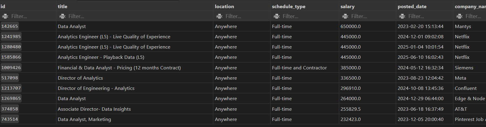
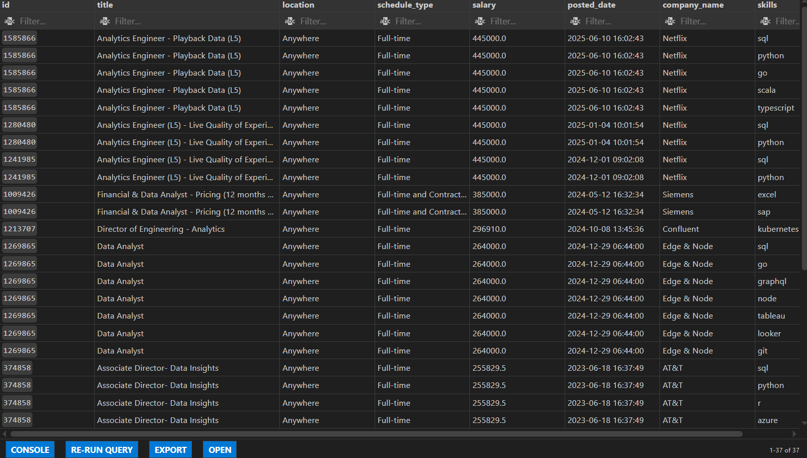
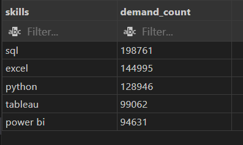
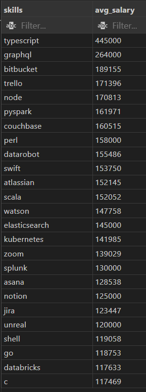
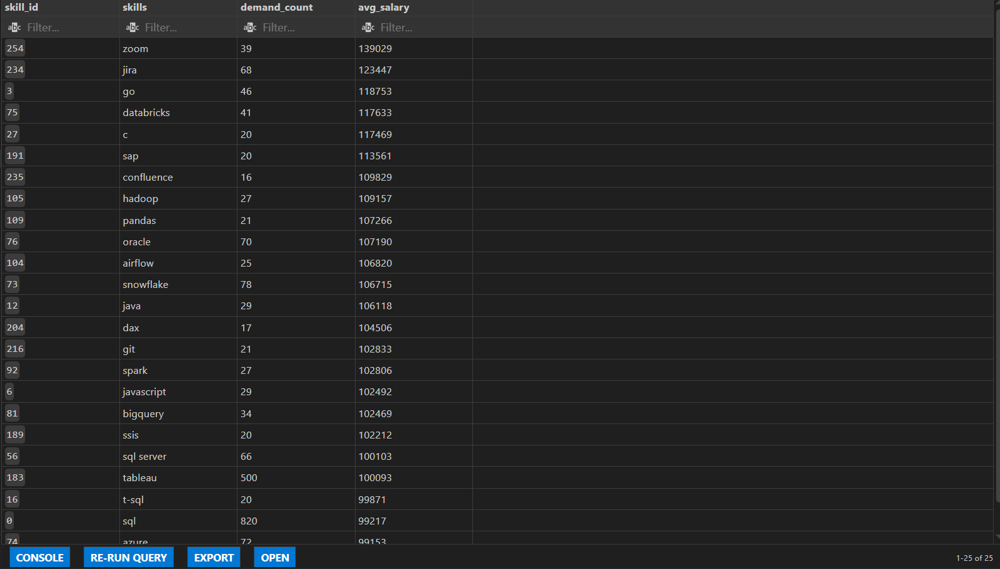

# Introduction
This project leverages SQL to extract actionable insights from a comprehensive dataset of job postings within the Data Analytics sector. By analyzing salary trends and skill demand from 2023 to the present, the study identifies high-value career opportunities and highlights the most critical technical skills required to succeed in today’s data-driven economy.
# Background
This project was developed using a specialized dataset provided by Luke Barousse's [SQL course](https://www.lukebarousse.com/sql) for data analytics, which contains comprehensive information on job titles, salary structures, and required skills within the data industry. The primary goal of this analysis is to navigate the complexities of the current job market by answering five key strategic questions:

1. **Top-Paying Data Analyst Roles**: Which job titles offer the highest financial compensation in the current market?

2. **Skills for High-Paying Roles**: What specific technical skills are required for these top-tier positions?

3. **In-Demand Skills**: Which competencies are most frequently requested across all Data Analytics job postings?

4. **Skills Associated with High Salaries**: Which individual skills are most strongly correlated with increased earning potential?

5. **Optimal Skills for Career Growth**: Which skills offer the best balance of high demand and high pay, providing the maximum return on learning investment?
# Tools I used
In this project, I utilized a variety of tools to conduct my analysis:

- **SQL** (Structured Query Language): Enabled me to interact with the database, extract insights, and answer my key questions through queries.
- **PostgreSQL**: As the database management system, PostgreSQL allowed me to store, query, and manipulate the job posting data.
- **Visual Studio Code:** This open-source administration and development platform helped me manage the database and execute SQL queries.


# The analysis

Each query for this project aimed at investigating specific aspects of the data analyst job market. Here’s how I approached each question:

### 1. Top-Paying Data Analyst Roles

To identify the highest-paying opportunities, I filtered the dataset for Data Analyst roles with disclosed annual salaries, focusing exclusively on remote positions. The resulting analysis highlights the top 10 job postings, showcasing the maximum earning potential for global data professionals.

```sql
SELECT 
    job_id as id,
    job_title as title,
    job_location as location,
    job_schedule_type as schedule_type,
    salary_year_avg as salary,
    job_posted_date as posted_date,
    name as company_name
from job_postings_fact
     Left JOIN company_dim ON job_postings_fact.company_id = company_dim.company_id
WHERE salary_year_avg IS NOT NULL 
      AND job_title_short = 'Data Analyst'
      and job_location = 'Anywhere'
ORDER BY salary_year_avg DESC
LIMIT 10;
```


### 2. Skills for High-Paying Roles
By cross-referencing the highest salaries with required technical skills, I identified the specific technology stack used by the industry's top earners. This provides a clear blueprint of the advanced tools needed to transition into elite, high-compensation data positions.
```sql
with top_paying_jobs as (
SELECT 
    job_id as id,
    job_title as title,
    job_location as location,
    job_schedule_type as schedule_type,
    salary_year_avg as salary,
    job_posted_date as posted_date,
    name as company_name
from job_postings_fact
     Left JOIN company_dim ON job_postings_fact.company_id = company_dim.company_id
WHERE salary_year_avg IS NOT NULL 
      AND job_title_short = 'Data Analyst'
      and job_location = 'Anywhere'
ORDER BY 
    salary_year_avg DESC
LIMIT 
    10)

SELECT 
top_paying_jobs.*,
    skills 
from top_paying_jobs
     inner JOIN skills_job_dim ON top_paying_jobs.id = skills_job_dim.job_id
     inner JOIN skills_dim ON skills_job_dim.skill_id = skills_dim.skill_id
```


### 3. Most In-Demand Skills
I aggregated the total count of skill mentions across all job postings to pinpoint the most universally required technical competencies. This highlights the essential "must-have" skills that every Data Analyst should master to maximize their overall employability.
```sql
SELECT
     sd.skills,
     count(sjd.*) as demand_count
from skills_job_dim as sjd
     inner JOIN skills_dim as sd ON sjd.skill_id = sd.skill_id
     inner JOIN job_postings_fact as jpf ON sjd.job_id = jpf.job_id
     WHERE jpf.job_title_short = 'Data Analyst'
group by 
     sd.skill_id, sd.skills
order by
      demand_count DESC
limit 5;
```

### 4. Skills Associated with High Salaries
By calculating the average salary per individual skill, I isolated the high-value niche technologies that command a significant financial premium. This identifies specialized areas where deep expertise leads to the most substantial increases in earning power.

```sql
SELECT
    sd.skills,
    round(avg(jpf.salary_year_avg)) as avg_salary
from skills_job_dim as sjd
     inner JOIN skills_dim as sd ON sjd.skill_id = sd.skill_id
     inner JOIN job_postings_fact as jpf ON sjd.job_id = jpf.job_id
     WHERE jpf.job_title_short = 'Data Analyst' and 
           jpf.salary_year_avg IS NOT NULL AND
           jpf.job_location = 'Anywhere'
           
group by 
    sd.skill_id, sd.skills
order by 
    avg_salary DESC
limit 25;
```

### 5. Optimal Skills to Learn
I analyzed the intersection of high market demand and average salaries to determine the most strategic skills for career advancement. This dual-axis visualization helps identify the "sweet spot" where learning effort meets maximum financial and professional return.

```sql
WITH top_paying_skills AS (
    SELECT
        sd.skill_id,
        sd.skills,
        ROUND(AVG(jpf.salary_year_avg)) AS avg_salary
    FROM skills_job_dim AS sjd
    INNER JOIN skills_dim AS sd ON sjd.skill_id = sd.skill_id
    INNER JOIN job_postings_fact AS jpf ON sjd.job_id = jpf.job_id
    WHERE 
        jpf.job_title_short = 'Data Analyst' 
        AND jpf.salary_year_avg IS NOT NULL 
        AND jpf.job_work_from_home = TRUE
    GROUP BY 
        sd.skill_id, 
        sd.skills
),

top_demanded_skills AS (
    SELECT
        sd.skill_id,
        sd.skills,
        COUNT(sjd.*) AS demand_count
    FROM skills_job_dim AS sjd
    INNER JOIN skills_dim AS sd ON sjd.skill_id = sd.skill_id
    INNER JOIN job_postings_fact AS jpf ON sjd.job_id = jpf.job_id
    WHERE 
        jpf.job_title_short = 'Data Analyst'
        AND jpf.salary_year_avg IS NOT NULL
        AND jpf.job_work_from_home = TRUE
    GROUP BY 
        sd.skill_id, 
        sd.skills
)

SELECT 
    tds.skill_id,
    tds.skills,
    tds.demand_count,
    tps.avg_salary
FROM top_demanded_skills AS tds
INNER JOIN top_paying_skills AS tps ON tds.skill_id = tps.skill_id
WHERE 
    tds.demand_count > 10
ORDER BY   
    tps.avg_salary DESC
LIMIT 25;
```

# Key Findings

- **SQL is the Market Cornerstone:** SQL remains the undisputed foundation of the data industry, appearing as the primary requirement in nearly **200,000 job postings** and serving as a critical skill for both entry-level and high-paying roles.

- **Premium Compensation in Big Tech:** The highest financial rewards are concentrated within major tech organizations like **Netflix and Meta**, where remote specialized roles can reach compensation levels of up to **$650,000**.

- **The "Software Engineering" Premium:** There is a significant salary boost for analysts who adopt software development tools; skills like **TypeScript and GraphQL** command the highest average salaries in the current market.

- **Visualization is Non-Negotiable:** Proficiency in Business Intelligence tools, specifically **Tableau and Power BI**, is essential for professional viability, with these platforms appearing in over **190,000 job listings** combined.

- **Strategic Learning Path:** For professionals seeking the highest return on investment, focusing on cloud infrastructure and project management tools like **Databricks and Jira** offers the best balance of market demand and high salary potential.

# What I learned
- **Advanced Data Integration:** Mastered the use of complex JOIN operations to merge diverse datasets, allowing for a multi-dimensional analysis of job market trends.

- **Query Optimization & Structure:** Developed a deep understanding of Subqueries and Common Table Expressions (CTEs) to break down complex business questions into modular, readable, and efficient code.

- **Strategic Troubleshooting:** Refined my ability to identify and resolve logic errors and bugs within SQL scripts, ensuring the highest level of data integrity and accuracy.

- **Analytical Logic:** Strengthened my ability to translate vague business inquiries into precise technical solutions, effectively navigating raw data to uncover actionable market patterns.
# Conclusions

Through this project, I have effectively bridged the gap between technical SQL execution and strategic business intelligence, proving my ability to transform large-scale data into actionable market insights. This analysis not only solidified my advanced analytical toolkit but also provided a data-driven roadmap for navigating the high-demand skills of the modern Data Analytics landscape.